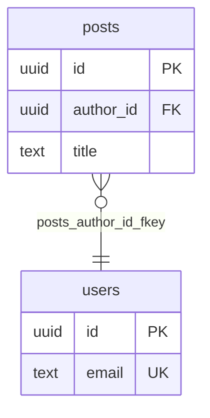

import { Callout, Status } from "@/components/mdx";

export const metadata = {
  title: "Exporters",
  description: "The exporters available today — Titan JSON, PostgreSQL SQL, Mermaid ERD, Prisma, and Drizzle — plus planned targets.",
};

# Exporters

An exporter turns a validated schema into target-specific output. Each one is a pure function: a `TitanSchema` in, files (and warnings) out. Validate first, then export — see [Diagnostics](/diagnostics).

Most exporters return the shared `ExportResult` shape from `@titanbase/core`:

```typescript
interface ExportResult {
  files: { path: string; content: string }[];
  warnings: { code: string; message: string; path?: string }[];
}
```

The PostgreSQL exporter is the one exception today: it returns `{ sql: string; warnings: string[] }`.

## Titan JSON

<Status value="Available" />

- **Output file:** `<project>.titan.json`
- **Supports:** the complete schema — the canonical, portable source of truth.
- **How it's produced:** `JSON.stringify(schema, null, 2)` (2-space JSON). On load, the schema is normalized (strings trimmed; `tables`, `enums`, and `relations` sorted by name).
- **Warnings:** none — this is a faithful serialization of your schema.

This is the file you keep in version control and reopen in the editor.

## PostgreSQL SQL

<Status value="Available" />

`@titanbase/export-postgres` — `exportPostgres(schema)`

- **Output file:** `<project>.sql`
- **Returns:** `{ sql, warnings }`

**Supports:**

- `CREATE SCHEMA` for any table that sets a `schema` namespace
- `CREATE TYPE ... AS ENUM` for enums
- `CREATE TABLE` with columns, `NOT NULL`, `UNIQUE`, and `DEFAULT`
- Primary keys as a named `CONSTRAINT ... PRIMARY KEY` (single or composite)
- Foreign keys via `ALTER TABLE ... ADD CONSTRAINT`, with `ON DELETE` / `ON UPDATE`
- Indexes, including `USING <method>`, partial `WHERE`, and `UNIQUE`
- `COMMENT ON` for tables, columns, indexes, constraints, and types (from `description`)
- Safe identifier quoting and deterministic output

**Known limitations / warnings:**

- An unknown column type falls back to `text` with a warning.
- An index referencing a missing column is skipped with a warning.
- An unsupported index method is emitted without `USING` and warned.
- A non-`postgres`/`generic` dialect is warned (types may not be supported).

```sql
CREATE TYPE "post_status" AS ENUM ('draft', 'published', 'archived');

CREATE TABLE "users" (
  "id" uuid NOT NULL DEFAULT gen_random_uuid(),
  "email" text NOT NULL UNIQUE,
  CONSTRAINT "users_pkey" PRIMARY KEY ("id")
);

ALTER TABLE "posts" ADD CONSTRAINT "posts_author_id_fkey"
  FOREIGN KEY ("author_id") REFERENCES "users" ("id") ON DELETE CASCADE;
```

## Mermaid ERD

<Status value="Available" />

`@titanbase/export-mermaid` — `exportMermaid(schema, options?)`

- **Output file:** `schema.mmd`
- **Returns:** `ExportResult`

**Supports:**

- An `erDiagram` with one entity per table
- Columns with their type label and `PK` / `FK` / `UK` markers (toggle with `includeColumnKeys`)
- Relations with cardinality connectors and a label

**Known limitations / warnings:**

- Multi-column indexes are not represented (warned).
- Partial indexes and non-`btree` methods are not represented (warned).
- Identifier collisions are auto-renamed (warned).
- A relation referencing a missing table is skipped; a missing column is warned but the table-level relation is still drawn.



## Prisma schema

<Status value="Available" />

`@titanbase/export-prisma` — `exportPrisma(schema, options?)`

- **Output file:** `schema.prisma`
- **Returns:** `ExportResult`

**Supports:**

- `generator` and `datasource` blocks (provider defaults to `postgresql`, URL env defaults to `DATABASE_URL`)
- `model` blocks with scalar fields, `@id` / `@@id`, `@unique`, and `@default`
- `enum` blocks, with `@map` for values that need it
- `@@index` / `@@unique` where safe
- `@map` / `@@map` for names that aren't valid Prisma identifiers
- Relation fields for `many-to-one` and `one-to-one` relations, with `onDelete` / `onUpdate`

**Known limitations / warnings:**

- `many-to-many` and `one-to-many` relations, or relations whose target isn't a primary/unique key, keep their scalar columns and emit an "ambiguous relation" warning instead of generating a relation field.
- Partial index predicates and non-`btree` methods are omitted (warned).
- Unsupported column types fall back to `String` (warned); unsupported defaults are omitted (warned).
- Table `schema` namespaces require Prisma multi-schema config and are omitted (warned).

```prisma
model User {
  id    String @id @default(uuid()) @db.Uuid
  email String @unique
  posts Post[] @relation("posts_author_id_fkey")
}
```

## Drizzle (PostgreSQL) schema

<Status value="Available" />

`@titanbase/export-drizzle` — `exportDrizzle(schema, options?)`

- **Output file:** `schema.ts` (configurable via `schemaFilePath`)
- **Returns:** `ExportResult`

**Supports:**

- `pgTable` and `pgEnum` declarations
- Column builders (`uuid`, `text`, `integer`, `bigint`, `boolean`, `timestamp`, `date`, `numeric`, `jsonb`, `varchar`)
- `.primaryKey()`, `.notNull()`, `.unique()`, and `.default*()` helpers where safe
- Single and composite primary keys, indexes (`index` / `uniqueIndex`), and foreign keys
- Tables ordered by dependency so references resolve

**Known limitations / warnings:**

- Self-referencing foreign keys are omitted (warned); cyclic dependencies are reported so you can move a foreign key into a migration.
- Floating-point types are approximated with `numeric()` (warned).
- Partial index predicates and non-`btree` methods are omitted (warned).
- Unsupported types fall back to `text()` (warned); unsupported defaults are omitted (warned).
- Table `schema` namespaces require `pgSchema` and are omitted (warned).

```typescript
import { pgTable, uuid, text } from "drizzle-orm/pg-core";

export const users = pgTable("users", {
    id: uuid("id").primaryKey().notNull().defaultRandom(),
    email: text("email").notNull().unique(),
  }
);
```

## Warnings

Every exporter returns warnings alongside its output rather than failing. A warning means the target can't fully represent something and the exporter chose a safe fallback — review them before applying the result. Exporter warnings are **target-specific** and complement the general schema [diagnostics](/diagnostics).

## Planned exporters

<Status value="Planned" />

These targets are on the roadmap and **not available yet**:

- **DBML**
- **MySQL**
- **SQLite**
- **Neon / Supabase presets**

Want a target that isn't here yet? See the [Plugin API](/plugins) and [Contributing](/contributing).
